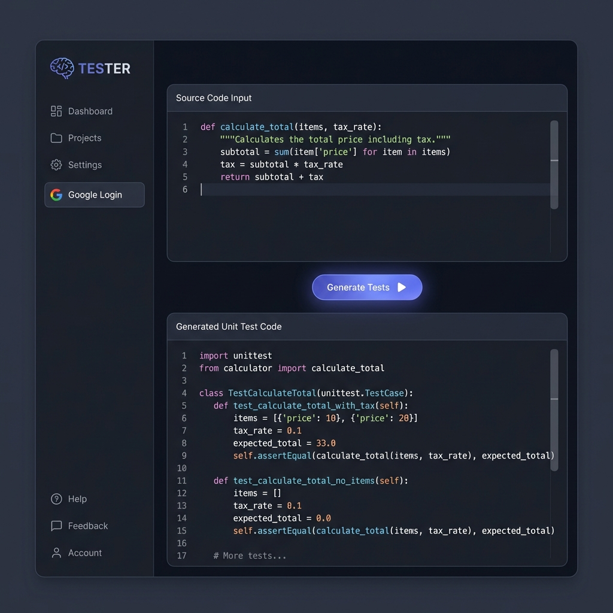
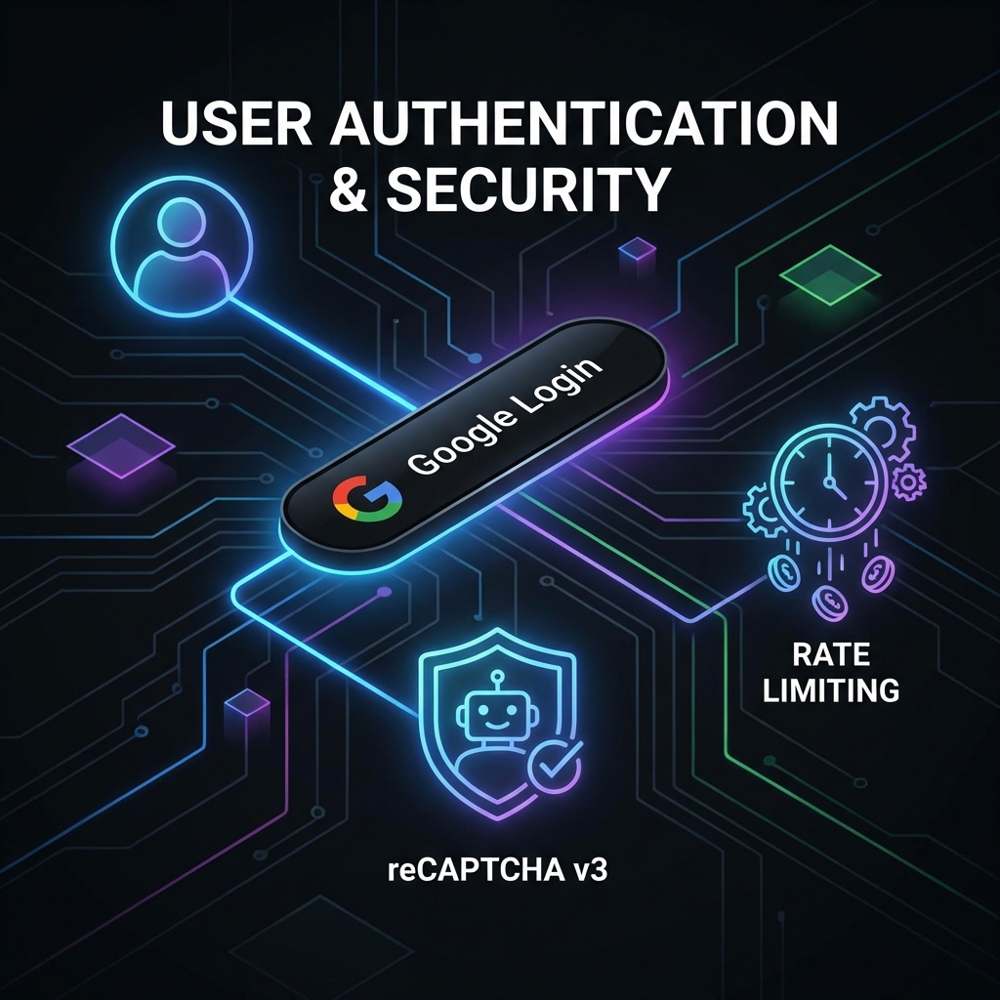
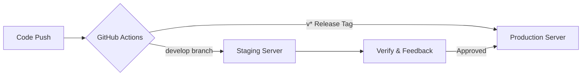

# LLM 기반 단위 테스트 자동 생성 시스템: TESTER

[](https://github.com/SJ-Son/TESTER) 
[](https://github.com/SJ-Son/TESTER)

## 1. 프로젝트 소개
작성한 소스 코드를 분석하여 테스트 코드(Unit Test)를 자동으로 만들어주는 도구입니다. LLM(Large Language Model)이 답변을 생성할 때 발생할 수 있는 오류를 줄이고, 실제 서비스 운영 시 고려해야 할 보안과 배포 자동화 과정을 직접 구현하며 학습한 프로젝트입니다.

---

## 2. 주요 구현 사항 및 문제 해결

### 🔍 LLM 답변의 정확도 향상 (입력 검증 및 프롬프트 제어)
AI가 엉뚱한 코드를 생성하거나 문법 오류를 내는 것을 방지하기 위해 다음과 같은 장치를 마련했습니다.



- **언어 적합성 검사**: 사용자가 선택한 언어(Python, Java 등)와 실제 코드가 일치하는지 정규표현식으로 먼저 확인합니다. 엉뚱한 입력으로 인한 API 비용 낭비를 줄였습니다.
- **역할 정의(System Instruction)**: AI에게 '전문 QA 엔지니어'라는 역할을 부여하고, 결과물에 불필요한 설명 없이 순수 코드만 출력하도록 지침을 세밀하게 조정했습니다.

### 🛡️ 서비스 보안 및 사용자 인증
공개된 서비스에서 발생할 수 있는 남용 사례를 방지하기 위해 기본적인 보안 체계를 구축했습니다.



- **구글 로그인 연동**: Google OAuth 2.0과 JWT(JSON Web Token)를 이용하여 검증된 사용자만 기능을 사용할 수 있게 했습니다.
- **봇 차단 (reCAPTCHA v3)**: 사용자가 불편함을 느끼지 않으면서도, 비정상적인 자동화 도구(봇)의 접근을 차단했습니다.
- **호출 횟수 제한 (Rate Limit)**: 특정 사용자가 짧은 시간에 너무 많은 요청을 보내 서버와 API에 부하가 걸리는 것을 방지했습니다.

### ⚙️ 안정적인 배포 과정 (CI/CD)
코드를 수정하고 서비스에 반영하는 과정에서 실수를 줄이기 위해 자동화 파이프라인을 구축했습니다.



- **Staging/Production 분리**: 테스트용 서버와 실제 운영 서버를 나누어 배포합니다. 새로운 기능이 운영 서버에 바로 영향을 주지 않도록 관리합니다.
- **배포 최적화 (Efficiency)**: `README.md`나 이미지 파일만 수정되었을 때는 불필요한 빌드와 배포가 발생하지 않도록 **CI/CD 트리거 조건(`paths-ignore`)**을 설정하여 자원 낭비를 줄였습니다.
- **컨테이너화 (Docker)**: 어떤 환경에서도 동일하게 실행될 수 있도록 Docker를 활용해 애플리케이션을 패키징했습니다.

---

## 3. 사용 기술 및 이유 (Tech Stack)

| 영역 | 사용 기술 | 선택 이유 |
| --- | --- | --- |
| **Backend** | Python, FastAPI | 비동기 처리가 강력하여 AI의 긴 응답(Streaming)을 효율적으로 전달할 수 있습니다. |
| **Frontend** | Vue.js 3, Tailwind CSS | 반응형 UI를 빠르게 구축할 수 있고, 사용자 경험이 매끄러운 SPA를 만들기 적합합니다. |
| **AI API** | Google Gemini | 빠른 응답 속도와 최신 모델의 코드 이해 능력이 우수하여 선택했습니다. |
| **Cloud** | Google Cloud Run | 서버를 직접 관리하지 않아도 사용량에 따라 유연하게 조절되는 환경을 경험하고자 사용했습니다. |

---

## 4. 프로젝트 구조

```text
├── backend/            # API 서버 및 핵심 로직
│   └── src/auth.py     # 로그인, 보안(reCAPTCHA) 관련 코드
├── frontend/           # 웹 인터페이스 (Vue.js)
├── tests/              # 시스템이 잘 작동하는지 확인하기 위한 테스트 스크립트
├── .github/workflows/  # 자동으로 배포해주는 설정 파일 (GitHub Actions)
└── Dockerfile          # 서버 실행 환경 설정 파일
```

---

## 5. 실행 방법 (Getting Started)

### 로컬 실행 방법
```bash
# 1. 서버(Backend) 실행
cd backend && pip install -r requirements.txt
python src/main.py

# 2. 웹(Frontend) 실행
cd frontend && npm install && npm run dev
```

### 테스트 실행
```bash
# 시스템 보안 및 작동 상태 확인
export PYTHONPATH=$PYTHONPATH:.
python3 -m pytest backend/tests/test_security_hardening.py
```
