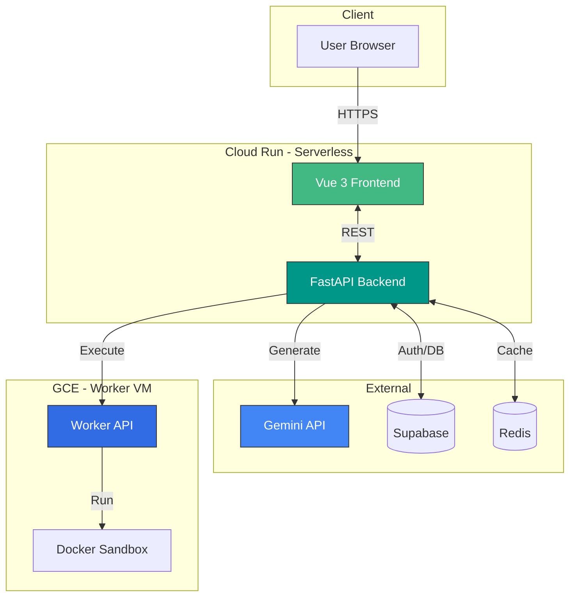

<div align="center">

# TESTER
### AI-Powered Test Code Generator

<p align="center">
  
  
  
  
  
</p>

[Documentation](#-documentation) · [Report Bug](https://github.com/sonseongjun/TESTER/issues) · [Request Feature](https://github.com/sonseongjun/TESTER/issues)

</div>

---

## 📖 목차

- [프로젝트 소개](#-프로젝트-소개)
- [주요 기능](#-주요-기능)
- [아키텍처](#-아키텍처)
- [프로젝트 구조](#-프로젝트-구조)
- [기술 스택](#-기술-스택)
- [시작하기](#-시작하기)
  - [사전 요구사항](#사전-요구사항)
  - [Backend 설정](#backend-설정)
  - [Frontend 설정](#frontend-설정)
- [환경 변수](#-환경-변수)
- [라이선스](#-라이선스)

---

## 🔭 프로젝트 소개

**TESTER**는 Google Gemini API를 활용하여 프로젝트의 테스트 코드를 자동으로 생성해주는 AI 서비스입니다. Python, JavaScript, Java 등 다양한 언어의 단위 테스트를 빠르고 정확하게 생성하여 개발 생산성을 높여줍니다.

---

## ✨ 주요 기능

| 기능 | 설명 |
|:---:|---|
| 🤖 **AI 테스트 생성** | **Gemini API**를 활용한 문맥 기반 테스트 코드 자동 생성 (Python, JS, Java 지원) |
| ⚡ **실시간 스트리밍** | Server-Sent Events (SSE)를 통해 코드 생성 과정을 실시간으로 확인 |
| 🔒 **안전한 실행** | 별도의 Worker VM 내 격리된 **Docker Sandbox** 환경에서 코드 실행 |
| 💾 **스마트 캐싱** | **Redis**를 이용한 응답 캐싱으로 API 비용 절감 및 응답 속도 향상 |
| 🛡️ **강력한 보안** | **Supabase Auth** 연동 및 민감 데이터 암호화 저장 |
| 📊 **모니터링** | Connection Pool 및 Latency 정보를 포함한 상세한 Health Check 제공 |

---

## 🏗️ 아키텍처

Serverless의 확장성과 VM의 격리성을 결합한 하이브리드 아키텍처를 사용합니다.



---

## 📂 프로젝트 구조

```bash
TESTER/
├── backend/                # FastAPI Backend Service
│   ├── src/                # Application Source Code
│   ├── tests/              # Backend Unit Tests
│   └── requirements.txt    # Python Dependencies
├── frontend/               # Vue 3 Frontend Application
│   ├── src/                # Frontend Source Code
│   ├── public/             # Static Assets
│   └── package.json        # Node Dependencies
├── worker/                 # Isolated Execution Worker
│   ├── Dockerfile.sandbox  # Sandboxed Environment Definition
│   └── main.py             # Worker Entry Point
└── docker-compose.yml      # Local Development Orchestration
```

---

## 🛠 기술 스택

### Frontend
-  **Vue 3** - Progressive JavaScript Framework
-  **TypeScript** - Typed JavaScript at Any Scale
-  **TailwindCSS** - Utility-first CSS Framework
-  **Vite** - Next Generation Frontend Tooling

### Backend
-  **FastAPI** - High performance web framework
-  **Python 3.12** - Modern Python
-  **Pydantic** - Data validation

### Infrastructure & Data
-  **Supabase** - Open Source Firebase Alternative
-  **Redis** - In-memory Data Structure Store
-  **Docker** - Containterization

---

## 🚀 시작하기

로컬 환경에서 프로젝트를 실행하는 방법입니다.

### 사전 요구사항
- **Python** 3.12+
- **Node.js** 20+
- **Docker** (optional, for worker)

### Backend 설정

1. **디렉토리 이동**
   ```bash
   cd backend
   ```

2. **가상환경 생성 및 활성화**
   ```bash
   python3 -m venv .venv
   source .venv/bin/activate
   ```

3. **의존성 패키지 설치**
   ```bash
   pip install -r requirements.txt
   ```

4. **환경 변수 설정**
   ```bash
   cp .env.example .env
   # .env 파일을 열어 필요한 키 값을 입력하세요
   ```

5. **서버 실행**
   ```bash
   uvicorn src.main:app --reload
   ```

### Frontend 설정

1. **디렉토리 이동**
   ```bash
   cd frontend
   ```

2. **의존성 패키지 설치**
   ```bash
   npm install
   ```

3. **환경 변수 설정**
   ```bash
   cp .env.example .env.local
   # .env.local 파일을 열어 필요한 키 값을 입력하세요
   ```

4. **개발 서버 실행**
   ```bash
   npm run dev
   ```

   `http://localhost:5173`로 접속하여 확인합니다.

---

## 🔧 환경 변수

### Backend (.env)

| 변수명 | 설명 |
|--------|------|
| `GEMINI_API_KEY` | Google Gemini API 키 |
| `SUPABASE_URL` | Supabase 프로젝트 URL |
| `SUPABASE_SERVICE_ROLE_KEY` | 백엔드용 관리자 키 (Service Role) |
| `SUPABASE_JWT_SECRET` | JWT 토큰 검증용 시크릿 |
| `DATA_ENCRYPTION_KEY` | 데이터 암호화를 위한 32바이트 Base64 키 |

### Frontend (.env.local)

| 변수명 | 설명 |
|--------|------|
| `VITE_SUPABASE_URL` | Supabase 프로젝트 URL |
| `VITE_SUPABASE_ANON_KEY` | 공개 익명 키 (Anon Key) |
| `VITE_TURNSTILE_SITE_KEY` | Cloudflare Turnstile 사이트 키 |

---

## 📄 라이선스

MIT License
