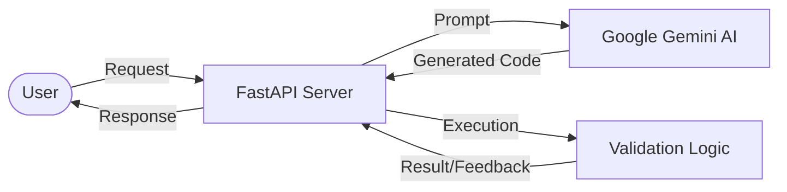

# TESTER

<div align="center">
  
  
  
  
  
</div>

**TESTER**는 FastAPI와 Vue 3로 구성된 웹 애플리케이션입니다. Google Generative AI를 이용한 콘텐츠 생성 및 인증 시스템을 포함합니다.

---

## ✨ 주요 기능 (Key Features)

*   ✨ **AI 콘텐츠 생성**: Google Generative AI(Gemini) 연동 텍스트/콘텐츠 생성
*   🚀 **API 서버**: Python FastAPI 기반 비동기 백엔드 구성
*   🎨 **UI**: Vue 3, TypeScript, TailwindCSS 기반 인터페이스
*   🔐 **인증**: JWT 및 Google OAuth 기반 사용자 인증
*   🛡️ **보안**: 데이터 암호화(Fernet) 저장 및 즉시 파기 정책 (Privacy First)
*   📜 **법적 고지**: 이용약관 및 개인정보처리방침 페이지 (`/terms`, `/privacy`)
*   📦 **인프라**: Docker 컨테이너, Firebase Hosting, Cloud Run, Supabase
*   🎭 **QA 자동화**: **Playwright** 기반 E2E 테스트 및 CI/CD 파이프라인 연동

---

## 🛠 기술 스택 (Tech Stack)

| 분류 | 기술 | 비고 |
| :--- | :--- | :--- |
| **Backend** | Python 3.12+, FastAPI, Google GenAI (Gemini) | |
| **Database** | **Supabase** (Postgres, Auth, Storage) | `도입 예정` |
| **ORM** | **SQLAlchemy** (or similar) | `도입 예정` |
| **Frontend** | Vue 3 (Composition API), TypeScript, Pinia, TailwindCSS | |
| **Execution** | **Playwright**, Cloud Run Jobs (Isolation) | `도입 예정` |
| **DevOps** | Docker, GitHub Actions, Firebase Hosting | |

---

## 🏗️ 시스템 아키텍처 (System Architecture)




---

## 🚀 로컬 개발 환경 설정 (Local Development Setup)

이 프로젝트를 로컬 개발 환경에서 실행하거나 기여하고 싶은 개발자를 위한 가이드입니다.

### 1. 사전 요구사항 (Prerequisites)

*   **Node.js** (v18 이상 권장)
*   **Python** (3.12 이상 권장)
*   **Git**

### 2. 프로젝트 클론 (Clone)

```bash
git clone https://github.com/your-username/TESTER.git
cd TESTER
```

### 3. 백엔드 설정 및 실행 (Backend)

백엔드 서버는 `localhost:8000`에서 실행됩니다.

```bash
cd backend

# 가상환경 생성 (권장)
python -m venv venv
source venv/bin/activate  # Mac/Linux
# venv\Scripts\activate   # Windows

# 의존성 설치
pip install -r requirements.txt

# 환경 변수 설정
cp .env.example .env
# .env 파일을 열어 필수 API Key를 입력하세요:
# - GEMINI_API_KEY
# - GOOGLE_CLIENT_ID & SECRET
# - RECAPTCHA_SECRET_KEY

# 서버 실행
uvicorn src.main:app --reload
```

### 4. 프론트엔드 설정 및 실행 (Frontend)

프론트엔드 개발 서버는 `localhost:5173`에서 실행됩니다.

```bash
cd frontend

# 의존성 설치
npm install

# 환경 변수 설정
cp .env.example .env
# .env 파일을 열어 필수 키를 입력하세요:
# - VITE_GOOGLE_CLIENT_ID
# - VITE_RECAPTCHA_SITE_KEY

# 개발 서버 실행
npm run dev
```

브라우저에서 `http://localhost:5173`으로 접속하여 애플리케이션을 확인하세요.

---

## 📂 폴더 구조 (Folder Structure)

```text
TESTER/
├── backend/
│   ├── src/
│   │   ├── api/              # API 엔드포인트 (v1 모듈화)
│   │   │   ├── v1/           # 도메인별 API (auth, generator, health)
│   │   │   └── routers.py    # 라우터 통합 및 버전 관리
│   │   ├── config/           # 환경 변수 및 글로벌 설정 (Pydantic Settings)
│   │   ├── languages/        # 언어별 테스트 생성 전략 (Strategy Pattern)
│   │   │   ├── factory.py    # 전략 팩토리
│   │   │   └── {python, javascript, java}.py
│   │   ├── services/         # 외부 서비스 연동 (Gemini AI)
│   │   ├── utils/            # 공용 유틸리티 (Lazy Loading 등)
│   │   ├── auth.py           # JWT 및 Google OAuth 보안 로직
│   │   ├── exceptions.py     # 구조화된 커스텀 예외 정의
│   │   └── main.py           # FastAPI 진입점 및 보안 미들웨어
│   ├── tests/                # 백엔드 단위 및 통합 테스트
│   └── ...
│
├── frontend/
│   ├── src/
│   │   ├── api/              # API 통신 모듈 (Axios/Fetch 기반)
│   │   ├── components/       # UI 컴포넌트 (Editor, Panel, Result)
│   │   ├── views/            # 페이지 레벨 컴포넌트 (Home, TOS, Privacy, Changelog)
│   │   ├── stores/           # Pinia 전역 상태 관리
│   │   ├── router/           # 클라이언트 사이드 라우팅 설정
│   │   └── utils/            # 프론트엔드 유틸리티 (Script Loader 등)
│   ├── package.json          # 프로젝트 메타데이터 및 의존성
│   └── vite.config.ts        # Vite 빌드 및 프록시 설정
│
├── pyproject.toml            # Ruff 린팅 설정
├── .pre-commit-config.yaml   # Git pre-commit 훅 설정
├── firebase.json             # Firebase 배포 설정
├── Dockerfile                # 도커 이미지 빌드 설정
└── README.md                 # 프로젝트 설명서
```

---

## 🔧 코드 품질 (Code Quality)

이 프로젝트는 일관된 코드 스타일과 높은 품질을 유지하기 위해 자동화된 도구를 사용합니다.

### Linting & Formatting

*   **Ruff**: Python 코드 린팅 및 포맷팅 (Black, Flake8, isort 대체)
*   **Pre-commit Hooks**: 커밋 전 자동 코드 품질 검사

```bash
# 린팅 실행
ruff check backend/src/

# 자동 포맷팅
ruff format backend/src/

# Pre-commit 훅 설치 (최초 1회)
pre-commit install
```

---

## 📖 API 문서 (API Documentation)

백엔드 서버가 실행 중일 때, 다음 주소에서 자동으로 생성된 API 문서를 확인할 수 있습니다.

*   **Swagger UI**: [http://localhost:8000/docs](http://localhost:8000/docs)
*   **ReDoc**: [http://localhost:8000/redoc](http://localhost:8000/redoc)

---

## 🔖 버전 관리 (Versioning)

상세 변경 이력은 [CHANGELOG.md](./CHANGELOG.md)에서 확인할 수 있습니다.

*   **Major**: 호환되지 않는 API 변경
*   **Minor**: 하위 호환성 있는 기능 추가
*   **Patch**: 하위 호환성 있는 버그 수정

---
## 🚀 Roadmap (TODO)

### ⚡ Phase 3: Infrastructure & Security (Completed)
- [x] **Redis Caching**: 응답 속도 최적화
- [x] **Service Layer**: 아키텍처 개선
- [x] **Data Privacy**: Supabase 연동 및 데이터 암호화 구현
- [x] **Monitoring**: Prometheus/Grafana 도입

### 🧠 Phase 4: AI QA Agent (Next Gen)
- [x] **E2E Automation**: Playwright 기반 테스트 자동화 및 GitHub Actions 연동
- [ ] **Self-Healing Tests**: 실행 실패 시 AI가 에러 로그를 분석하여 코드를 자동 수정
- [ ] **Text-to-Test**: 자연어 시나리오를 입력하여 Playwright 코드 자동 생성 (GenAI)
- [ ] **Edge Case Discovery**: AI가 극한의 경계값 데이터를 생성하여 서비스 안정성 검증
---

## 📄 라이선스 (License)

이 프로젝트의 소스 코드는 MIT 라이선스 하에 배포됩니다.
