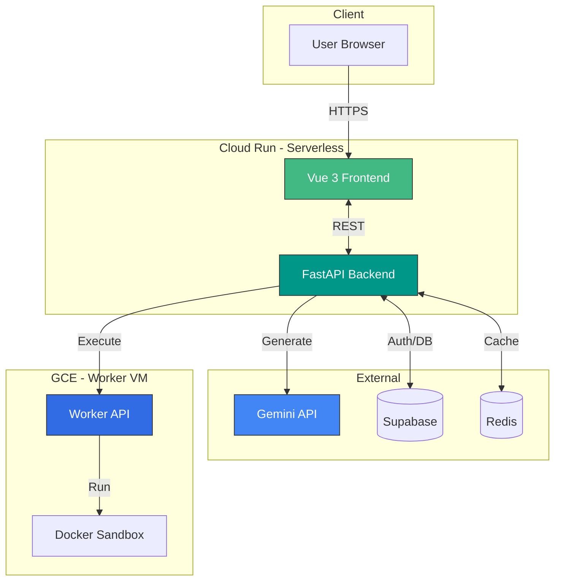

# TESTER

<div align="center">
  
**AI-Powered Test Code Generator**

Google Gemini API를 활용한 테스트 코드 자동 생성 웹 서비스

[](https://vuejs.org/)
[](https://fastapi.tiangolo.com/)
[](https://www.python.org/)
[](https://www.typescriptlang.org/)
[]()

[Documentation](#-documentation) · [Quick Start](#-quick-start) · [Changelog](./CHANGELOG.md)

</div>

---

## ✨ Features

- 🤖 **AI Test Generation** - Gemini API로 Python/JavaScript/Java 테스트 코드 자동 생성
- ⚡ **Real-time Streaming** - SSE로 생성 과정 실시간 스트리밍
- 🔒 **Secure Architecture** - Supabase Auth + Fail-Closed 암호화 + Isolated Docker Execution
- 💾 **Smart Caching** - Redis 캐싱으로 비용 절감 및 응답 속도 향상 (LRU 최적화)
- 📊 **Enhanced Monitoring** - 상세 Health Check (latency, connection pool 정보)
- 🧪 **High Test Coverage** - 70% 테스트 커버리지 (핵심 서비스 80%+)
- 📱 **Responsive Design** - 모바일/데스크탑 최적화

## 🆕 What's New in v0.7.0

### 안정성 개선
- ✅ Redis 연결 풀 Singleton 패턴 + TCP Keepalive
- ✅ 데이터 손실 방지 (동기 저장 + 실패 시 사용자 경고)
- ✅ Graceful shutdown (리소스 정리)
- ✅ Health check 강화 (latency, connection pool 정보)

### 코드 품질
- ✅ Magic number/string 제거 (constants.py 중앙화)
- ✅ 에러 메시지 한글화 95%
- ✅ ExecutionService 100% 테스트 커버리지
- ✅ 전체 테스트 커버리지 49% → 70%

### 성능 최적화
- ✅ CacheService LRU 캐싱 적용
- ✅ GeminiService 인스턴스 재사용

## 🏗️ Architecture



**Hybrid 실행 환경:**
- **Web/API**: Cloud Run (Serverless, Auto-scaling)
- **Code Execution**: GCE VM (Docker Sandbox, Isolated)

## 🛠 Tech Stack

**Frontend:** Vue 3 · TypeScript · Pinia · TailwindCSS · Vite  
**Backend:** FastAPI · Python 3.12 · Gemini API  
**Database:** Supabase (PostgreSQL) · Redis  
**Infrastructure:** Cloud Run · GCE · Docker · GitHub Actions

## 🚀 Quick Start

### Prerequisites
```bash
Python 3.12+ · Node.js 20+ · Redis (optional)
```

### Backend
```bash
cd backend
python3 -m venv .venv && source .venv/bin/activate
pip install -r requirements.txt

# Setup .env file
cp .env.example .env
# Edit .env with required values

uvicorn src.main:app --reload
```

**Required Environment Variables:**
```env
GEMINI_API_KEY=your_key
SUPABASE_URL=your_url
SUPABASE_SERVICE_ROLE_KEY=your_key  
SUPABASE_JWT_SECRET=your_secret
DATA_ENCRYPTION_KEY=your_32byte_base64_key
```

### Frontend
```bash
cd frontend
npm install

cp .env.example .env.local
# Edit .env.local

npm run dev
```

**Required Environment Variables:**
```env
VITE_SUPABASE_URL=your_url
VITE_SUPABASE_ANON_KEY=your_key
VITE_TURNSTILE_SITE_KEY=your_key
```

**Open:** http://localhost:5173

## 📚 Documentation

| Module | Description |
|--------|-------------|
| [Backend Guide](./backend/README.md) | FastAPI 구조, 비동기 처리, 레이어 아키텍처, v0.7.0 개선사항 |
| [Frontend Guide](./frontend/00_FRONTEND_GUIDE.md) | Vue 3, Pinia, 컴포넌트 설계 |
| [Worker Guide](./worker/00_WORKER_GUIDE.md) | Docker 샌드박스, VM 운영 |
| [Changelog](./CHANGELOG.md) | 버전별 변경 이력 |

## 🧪 Testing

```bash
# Backend Tests
cd backend
pytest --cov=src tests/

# Coverage Report
pytest --cov=src --cov-report=html tests/
# Open htmlcov/index.html

# Frontend E2E
cd frontend
npx playwright test
```

**Current Coverage:** 70% (핵심 서비스 80%+)
- ExecutionService: 100%
- Auth: 93%
- GenerationRepository: 93%  
- GeminiService: 90%

## 📊 Monitoring

```bash
# Health Check (Enhanced v0.7.0)
curl http://localhost:8000/health

# Returns:
{
  "status": "healthy",
  "timestamp": "2026-02-09T09:00:00Z",
  "version": "0.7.0",
  "services": {
    "redis": {
      "status": "up",
      "latency_ms": 2.35,
      "connection_pool": {"max": 10, "available": 7}
    },
    "supabase": {
      "status": "up",
      "latency_ms": 45.67
    },
    "gemini": {
      "status": "configured",
      "model": "gemini-3-flash-preview"
    }
  }
}
```

## 🔄 Recent Updates

### v0.7.0 (2026-02-09)
- 🎯 안정성: Redis Singleton, 데이터 손실 방지, Graceful shutdown
- 📈 커버리지: 49% → **70%** (+21%p)
- 🚀 성능: LRU 캐싱, 인스턴스 재사용
- 📝 품질: Magic number 제거, 에러 메시지 한글화 95%
- 🩺 모니터링: Health check latency 및 connection pool 정보 추가

## 📄 License

MIT License

---

<div align="center">

**Built with ❤️ using Google Gemini API**

</div>