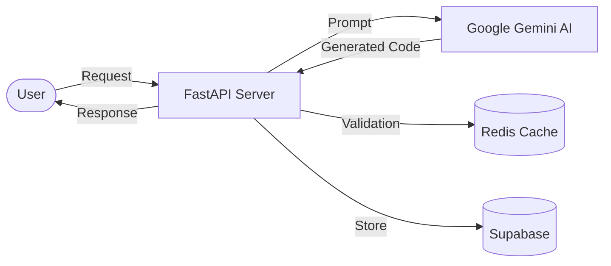

# TESTER

<div align="center">
  
**AI-Powered Test Code Generator**

Google Gemini를 활용한 지능형 테스트 코드 자동 생성 플랫폼

[](https://vuejs.org/)
[](https://fastapi.tiangolo.com/)
[](https://www.python.org/)
[](https://www.typescriptlang.org/)

</div>

---

## ✨ 주요 기능

- 🤖 **AI 테스트 생성**: Google Gemini API 기반 지능형 테스트 코드 자동 생성
- ⚡ **실시간 스트리밍**: SSE를 통한 실시간 코드 생성 결과 표시
- 🔐 **보안 강화**: JWT 인증, Cloudflare Turnstile, 데이터 암호화 (Fernet)
- 💾 **Redis 캐싱**: 차등 TTL 적용 (Gemini 2h, 히스토리 30m)
- 🎨 **반응형 UI**: 모바일/태블릿 최적화, 다크 모드 지원
- 🧪 **E2E 자동화**: Playwright 기반 테스트 및 CI/CD 통합
- 📜 **히스토리 관리**: Supabase 연동을 통한 생성 이력 영구 저장
- 🐳 **샌드박스 실행**: Docker 기반 격리 환경에서 생성된 코드 즉시 실행 및 검증

## 🏗️ 아키텍처



## 🛠 기술 스택

**Backend**
- Python 3.12+ | FastAPI | Google Gemini AI
- Supabase (PostgreSQL) | Redis | Prometheus

**Frontend**
- Vue 3 (Composition API) | TypeScript | Pinia
- TailwindCSS | Vite | Playwright

**Infrastructure**
- Docker | Cloud Run | Firebase Hosting
- GitHub Actions | Ruff

## 🚀 빠른 시작

### 사전 요구사항
- Node.js 18+
- Python 3.12+
- Redis (선택)

### 설치 및 실행

```bash
# 저장소 클론
git clone https://github.com/SJ-Son/TESTER.git
cd TESTER

# Backend 설정
cd backend
python -m venv venv && source venv/bin/activate
pip install -r requirements.txt
cp .env.example .env  # API 키 설정 필요
uvicorn src.main:app --reload

# Frontend 설정 (새 터미널)
cd frontend
npm install
cp .env.example .env  # 환경 변수 설정
npm run dev
```

**접속**: http://localhost:5173

## 📁 프로젝트 구조

```
TESTER/
├── backend/
│   ├── src/
│   │   ├── api/v1/          # API 엔드포인트 (auth, generator, health)
│   │   ├── services/        # 비즈니스 로직 (Gemini, Cache, Supabase)
│   │   ├── languages/       # 언어별 전략 (Python, JS, Java)
│   │   └── config/          # 환경 설정
│   └── tests/               # 단위/통합 테스트
│
├── frontend/
│   ├── src/
│   │   ├── components/      # UI 컴포넌트
│   │   ├── views/           # 페이지
│   │   ├── stores/          # Pinia 상태 관리
│   │   └── api/             # API 통신 모듈
│   └── e2e/                 # Playwright 테스트
│
└── .github/workflows/       # CI/CD
```

## 📖 문서

- **API 문서**: http://localhost:8000/docs (Swagger UI)
- **변경 이력**: [CHANGELOG.md](./CHANGELOG.md)
- **기여 가이드**: 이슈 및 PR 환영합니다

## 🔧 개발 도구

```bash
# 린팅 (Backend)
ruff check backend/src/
ruff format backend/src/

# 테스트 (Backend)
pytest backend/tests/

# E2E 테스트 (Frontend)
npm run test:e2e

# Pre-commit 훅 설치
pre-commit install
```

## 🚀 로드맵

**Phase 4: AI QA Agent** (현재)
- [x] E2E 테스트 자동화
- [ ] Self-Healing Tests (AI 기반 자동 수정)
- [ ] Text-to-Test (자연어 → 테스트 코드)

**Phase 5: Platform Evolution**
- [ ] Multi-Model 지원 (Claude, GPT)
- [ ] 코드 품질 대시보드

**Phase 6: Enterprise**
- [ ] IDE 플러그인 (VSCode, IntelliJ)
- [ ] CI/CD Marketplace 통합

## 📄 라이선스

MIT License 

---
