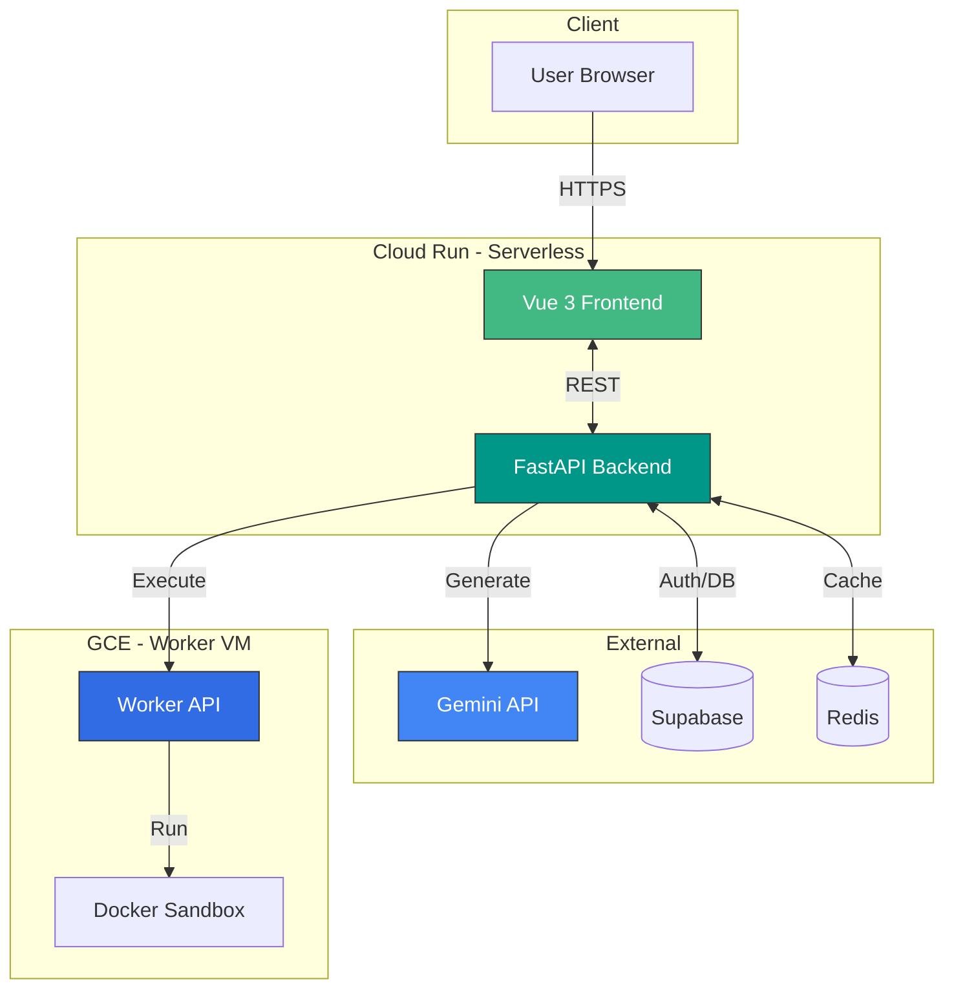

# TESTER

<div align="center">
  
**AI-Powered Test Code Generator**

Google Gemini API를 활용한 테스트 코드 자동 생성 웹 서비스

[](https://vuejs.org/)
[](https://fastapi.tiangolo.com/)
[](https://www.python.org/)
[](https://www.typescriptlang.org/)

[Documentation](#-documentation) · [Quick Start](#-quick-start)

</div>

---

## ✨ Features

- 🤖 **AI Test Generation** - Gemini API로 Python/JavaScript/Java 테스트 코드 자동 생성
- ⚡ **Real-time Streaming** - SSE로 생성 과정 실시간 스트리밍
- 🔒 **Secure Architecture** - Supabase Auth + Fail-Closed 암호화 + Isolated Docker Execution
- 💾 **Smart Caching** - Redis 캐싱으로 비용 절감 및 응답 속도 향상
- 📱 **Responsive Design** - 모바일/데스크탑 최적화

## 🏗️ Architecture



**Hybrid 실행 환경:**
- **Web/API**: Cloud Run (Serverless, Auto-scaling)
- **Code Execution**: GCE VM (Docker Sandbox, Isolated)

## 🛠 Tech Stack

**Frontend:** Vue 3 · TypeScript · Pinia · TailwindCSS · Vite  
**Backend:** FastAPI · Python 3.12 · Gemini API  
**Database:** Supabase (PostgreSQL) · Redis  
**Infrastructure:** Cloud Run · GCE · Docker · GitHub Actions

## 🚀 Quick Start

### Prerequisites
```bash
Python 3.12+ · Node.js 20+ · Redis (optional)
```

### Backend
```bash
cd backend
python3 -m venv venv && source venv/bin/activate
pip install -r requirements.txt

# Setup .env file
cp .env.example .env
# Edit .env with required values

uvicorn src.main:app --reload
```

**Required Environment Variables:**
```env
GEMINI_API_KEY=your_key
SUPABASE_URL=your_url
SUPABASE_SERVICE_ROLE_KEY=your_key  
SUPABASE_JWT_SECRET=your_secret
DATA_ENCRYPTION_KEY=your_32byte_base64_key
```

### Frontend
```bash
cd frontend
npm install

cp .env.example .env.local
# Edit .env.local

npm run dev
```

**Required Environment Variables:**
```env
VITE_SUPABASE_URL=your_url
VITE_SUPABASE_ANON_KEY=your_key
VITE_TURNSTILE_SITE_KEY=your_key
```

**Open:** http://localhost:5173

## 📚 Documentation

| Module | Description |
|--------|-------------|
| [Backend Guide](./backend/README.md) | FastAPI 구조, 비동기 처리, 레이어 아키텍처 |
| [Frontend Guide](./frontend/00_FRONTEND_GUIDE.md) | Vue 3, Pinia, 컴포넌트 설계 |
| [Worker Guide](./worker/00_WORKER_GUIDE.md) | Docker 샌드박스, VM 운영 |
| [Changelog](./CHANGELOG.md) | 버전별 변경 이력 |

## 🧪 Testing

```bash
# Backend Tests
pytest --cov=src tests/

# Frontend E2E
npx playwright test
```

## 📊 Monitoring

```bash
# Health Check
curl http://localhost:8000/health
```

## 📄 License

MIT License

---