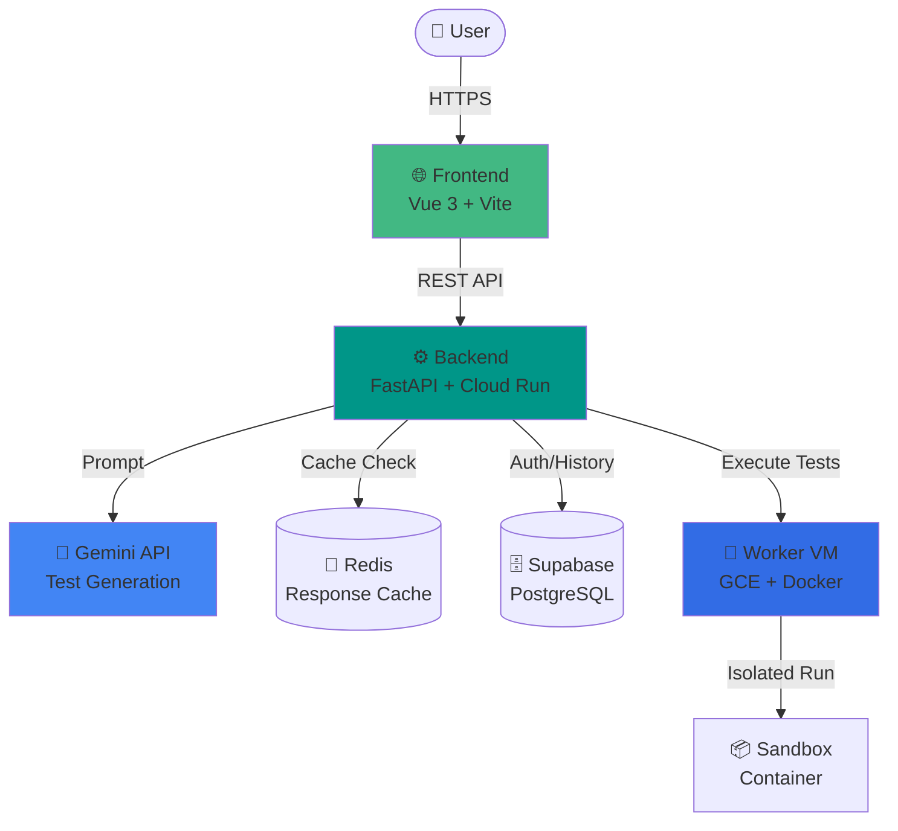

# TESTER

<div align="center">
  
**AI-Powered Test Code Generator**

Google Gemini API를 활용한 테스트 코드 자동 생성 플랫폼

[](https://vuejs.org/)
[](https://fastapi.tiangolo.com/)
[](https://www.python.org/)
[](https://www.typescriptlang.org/)

</div>

---

## 📌 주요 기능

### 🤖 AI 기반 테스트 생성
- Google Gemini API를 활용한 고품질 테스트 코드 자동 생성
- Python, JavaScript, Java 지원
- 실시간 스트리밍(SSE)으로 생성 과정 시각화

### 🔒 보안 우선 설계
- **Supabase Auth** - Google OAuth 기반 인증
- **Turnstile** - Cloudflare 봇 방지
- **Fail-Closed 암호화** - Fernet 암호화로 데이터 보호
- **Startup Validation** - 필수 환경 변수 누락 시 서버 시작 차단

### ⚡ 성능 최적화
- **Redis 캐싱** - AI 응답 2시간 캐시로 비용 절감 및 속도 향상
- **Offline-First History** - 로컬 저장 + 서버 동기화로 안정성 확보
- **비동기 처리** - FastAPI AsyncIO 기반 고성능 처리

### 🏗️ Hybrid 아키텍처
- **Cloud Run** - Serverless 웹/API 서버
- **GCE Worker VM** - Docker 샌드박스 기반 격리된 코드 실행
- **안전한 코드 주입** - `put_archive` 방식으로 특수문자도 안전하게 처리

## 🏗️ 시스템 아키텍처



## 🛠 기술 스택

### Backend
- **Framework**: FastAPI (Python 3.12)
- **AI**: Google Gemini API
- **Database**: Supabase (PostgreSQL)
- **Cache**: Redis
- **Auth**: Supabase Auth + JWT
- **Security**: Fernet Encryption, Turnstile

### Frontend
- **Framework**: Vue 3 (Composition API)
- **Language**: TypeScript
- **State**: Pinia
- **Styling**: TailwindCSS
- **Build**: Vite
- **Testing**: Playwright (E2E)

### Infrastructure
- **Hosting**: Google Cloud Run (Backend), Firebase Hosting (Frontend)
- **Worker**: Google Compute Engine (VM)
- **CI/CD**: GitHub Actions
- **Containerization**: Docker

### Monitoring & Observability
- **Logging**: Structured JSON logging
- **Health Checks**: `/health` endpoint for infrastructure monitoring
- **Metrics**: Prometheus instrumentation

## 📁 프로젝트 구조

```
TESTER/
├── backend/                 # FastAPI Backend
│   ├── src/
│   │   ├── api/             # API Endpoints (v1)
│   │   ├── services/        # Business Logic
│   │   ├── repositories/    # Data Access Layer
│   │   ├── languages/       # Language Strategy Pattern
│   │   └── utils/           # Utilities (Encryption, Logger)
│   └── tests/               # Backend Unit/Integration Tests
│
├── frontend/                # Vue 3 Frontend
│   ├── src/
│   │   ├── components/      # Reusable UI Components
│   │   ├── stores/          # Pinia State Management
│   │   ├── views/           # Page Components
│   │   └── api/             # API Client
│   └── e2e/                 # Playwright E2E Tests
│
├── worker/                  # Code Execution Worker
│   ├── main.py              # FastAPI Worker Server
│   ├── Dockerfile           # Worker Container
│   └── Dockerfile.sandbox   # Test Execution Sandbox
│
└── .github/workflows/       # CI/CD Pipelines
    ├── test.yml             # PR Testing
    ├── deploy-staging.yml   # Staging Deployment
    ├── deploy-prod.yml      # Production Deployment
    └── deploy-worker.yml    # Worker VM Deployment
```

## 🚀 빠른 시작

### Prerequisites
- Python 3.12+
- Node.js 20+
- Redis (선택, 로컬 개발용)

### 1. 저장소 클론

```bash
git clone https://github.com/SJ-Son/TESTER.git
cd TESTER
```

### 2. Backend 설정 및 실행

```bash
cd backend
python3 -m venv venv && source venv/bin/activate
pip install -r requirements.txt

# 환경 변수 설정
cp .env.example .env
# .env 파일 편집 (아래 필수 변수 입력)
```

**필수 환경 변수:**
```bash
GEMINI_API_KEY=              # Google Gemini API Key
SUPABASE_URL=                # Supabase Project URL
SUPABASE_SERVICE_ROLE_KEY=   # Supabase Service Role Key
SUPABASE_JWT_SECRET=         # Supabase JWT Secret
DATA_ENCRYPTION_KEY=         # Fernet Encryption Key (32 bytes base64)
```

**선택 환경 변수:**
```bash
REDIS_URL=redis://localhost:6379  # Redis 캐시 (없으면 캐싱 비활성화)
TURNSTILE_SECRET_KEY=              # Cloudflare Turnstile (없으면 봇 검증 비활성화)
WORKER_URL=http://localhost:5000   # Worker VM URL
```

```bash
# 서버 실행
uvicorn src.main:app --reload --port 8000
```

### 3. Frontend 설정 및 실행

```bash
cd frontend
npm install

# 환경 변수 설정
cp .env.example .env.local
# .env.local 편집
```

**필수 환경 변수:**
```bash
VITE_SUPABASE_URL=          # Supabase Project URL
VITE_SUPABASE_ANON_KEY=     # Supabase Anon Key
VITE_TURNSTILE_SITE_KEY=    # Cloudflare Turnstile Site Key
```

```bash
# 개발 서버 실행
npm run dev
```

**접속**: http://localhost:5173

### 4. Health Check 확인

```bash
# Backend 상태 확인
curl http://localhost:8000/health

# 정상 응답:
# {
#   "status": "healthy",
#   "services": {
#     "redis": {"status": "ok"},
#     "supabase": {"status": "ok"}
#   }
# }
```

## 📚 상세 문서

각 모듈별 구현 세부사항은 아래 문서를 참고하세요.

| 모듈 | 설명 | 문서 |
|------|------|------|
| **Backend** | FastAPI 아키텍처, 비동기 처리, 레이어 구조 | [📖 Backend README](./backend/README.md) |
| └ API | 엔드포인트 설계, Rate Limiting, 인증 | [📖 API Guide](./backend/src/api/00_API_GUIDE.md) |
| └ Services | 비즈니스 로직, 서비스 레이어 패턴 | [📖 Service Guide](./backend/src/services/00_SERVICE_GUIDE.md) |
| └ Languages | 언어별 Strategy 패턴 구현 | [📖 Language Guide](./backend/src/languages/00_LANGUAGE_STRATEGY_GUIDE.md) |
| **Frontend** | Vue 3 구조, Pinia 상태 관리, 컴포넌트 설계 | [📖 Frontend Guide](./frontend/00_FRONTEND_GUIDE.md) |
| └ Components | UI 컴포넌트 역할 및 Props/Emits | [📖 Component Guide](./frontend/src/components/00_COMPONENTS_GUIDE.md) |
| **Worker** | Docker 샌드박스, VM 운영, 보안 설정 | [📖 Worker Guide](./worker/00_WORKER_GUIDE.md) |
| **CHANGELOG** | 버전별 변경 이력 | [📖 Changelog](./CHANGELOG.md) |

## 🧪 테스트

```bash
# Backend 테스트
cd backend
pytest --cov=src tests/

# Frontend E2E 테스트
cd frontend
npx playwright test
```

## � 배포

GitHub Actions를 통한 자동 배포:
- **Push to `develop`** → Staging 환경 배포
- **Push to `main`** → Production 환경 배포

## 📊 모니터링

- **Health Check**: `GET /health` - 인프라 상태 확인
- **Cloud Run Logs**: Google Cloud Console에서 실시간 로그 확인
- **Startup Validation**: 서버 시작 시 자동 인프라 점검


## 📄 라이선스

MIT License

---