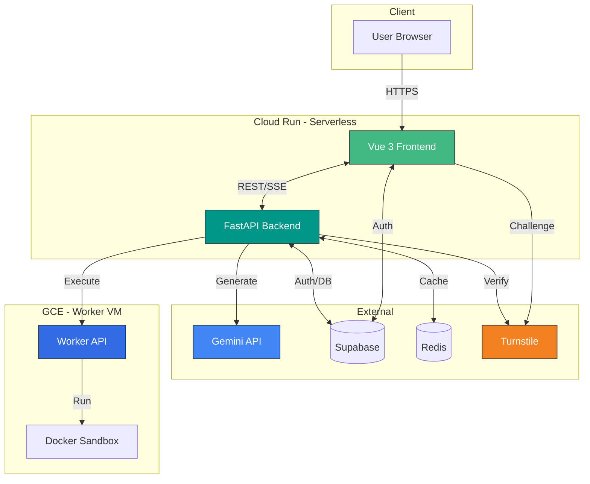

<div align="center">

# TESTER
### AI-Powered Test Code Generator

<p align="center">
  
  
  
  
  
  
  
</p>

[Report Bug](https://github.com/sonseongjun/TESTER/issues) · [Request Feature](https://github.com/sonseongjun/TESTER/issues)

</div>

---

## 📖 목차

- [프로젝트 소개](#-프로젝트-소개)
- [주요 기능](#-주요-기능)
- [아키텍처](#️-아키텍처)
- [프로젝트 구조](#-프로젝트-구조)
- [기술 스택](#-기술-스택)
- [시작하기](#-시작하기)
  - [사전 요구사항](#사전-요구사항)
  - [Backend 설정](#backend-설정)
  - [Frontend 설정](#frontend-설정)
  - [Worker 설정 (선택)](#worker-설정-선택)
- [환경 변수](#-환경-변수)
- [라이선스](#-라이선스)

---

## 🔭 프로젝트 소개

**TESTER**는 Google Gemini API를 활용하여 프로젝트의 테스트 코드를 자동으로 생성해주는 AI 서비스입니다. Python, JavaScript, Java 등 다양한 언어의 단위 테스트를 빠르고 정확하게 생성하여 개발 생산성을 높여줍니다.

---

## ✨ 주요 기능

| 기능 | 설명 |
|:---:|---|
| **AI 테스트 생성** | **Gemini API**를 활용한 문맥 기반 테스트 코드 자동 생성 (Python, JS, Java 지원) |
| **실시간 스트리밍** | Server-Sent Events (SSE)를 통해 코드 생성 과정을 실시간으로 확인 |
| **안전한 실행** | 별도의 Worker VM 내 격리된 **Docker Sandbox** 환경에서 코드 실행 |
| **스마트 캐싱** | **Redis**를 이용한 응답 캐싱으로 API 비용 절감 및 응답 속도 향상 |
| **강력한 보안** | **Supabase Auth** 연동 및 민감 데이터 AES/Fernet 암호화 저장 |
| **토큰 시스템** | 일일 보너스, 웰컴 보너스, Atomic 차감/적립 기반의 토큰 관리 |
| **모니터링** | Prometheus 메트릭 및 상세 Health Check (Redis, Supabase, Gemini 상태) 제공 |

---

## 🏗️ 아키텍처

Serverless의 확장성과 VM의 격리성을 결합한 하이브리드 아키텍처를 사용합니다.


```mermaid
graph TB
    subgraph Client
        U[User Browser]
    end

    subgraph "Cloud Run - Serverless"
        FE[Vue 3 Frontend]
        BE[FastAPI Backend]
    end

    subgraph External
        G[Gemini API]
        S[(Supabase)]
        R[(Redis)]
        T[Turnstile]
    end

    subgraph "GCE - Worker VM"
        W[Worker API]
        D[Docker Sandbox]
    end

    U -->|HTTPS| FE
    FE <-->|REST/SSE| BE
    FE <-->|Auth| S
    FE -->|Challenge| T
    BE -->|Generate| G
    BE <-->|Cache| R
    BE <-->|Auth/DB| S
    BE -->|Verify| T
    BE -->|Execute| W
    W -->|Run| D

    style FE fill:#42b883,stroke:#333,color:#fff
    style BE fill:#009688,stroke:#333,color:#fff
    style G fill:#4285f4,stroke:#333,color:#fff
    style W fill:#326ce5,stroke:#333,color:#fff
    style T fill:#f48120,stroke:#333,color:#fff
```

---

## 📂 프로젝트 구조

```
TESTER/
├── backend/                # FastAPI Backend Service
│   ├── src/
│   │   ├── api/v1/         # 라우터 (generator, execution, history, user)
│   │   ├── services/       # 비즈니스 로직 (gemini, token, cache, supabase)
│   │   ├── repositories/   # 데이터 접근 (generation_repository)
│   │   ├── languages/      # 언어별 전략 (python, java, javascript)
│   │   ├── utils/          # 공통 유틸 (logger, security)
│   │   └── main.py         # 앱 진입점 및 미들웨어
│   └── tests/              # 단위/통합/보안 테스트
├── frontend/               # Vue 3 + TypeScript Frontend
│   └── src/
│       ├── api/            # API 클라이언트 (generator, supabase)
│       ├── stores/         # Pinia 상태 관리
│       ├── types/          # 공유 타입 정의
│       └── views/          # 페이지 컴포넌트
├── worker/                 # Isolated Execution Worker
│   ├── main.py             # FastAPI Worker 서버
│   ├── security.py         # AST 기반 코드 보안 검사
│   └── Dockerfile.sandbox  # 샌드박스 실행 환경
├── docs/                   # 문서 (Changelog, Privacy 등)
└── docker-compose.yml      # 로컬 개발 오케스트레이션
```

---

## 🛠 기술 스택

### Frontend
-  **Vue 3** (Composition API + Script Setup)
-  **TypeScript** - 엄격한 타입 안전성
-  **TailwindCSS** - Utility-first CSS
-  **Pinia** - 상태 관리
-  **Vite** - 빌드 도구

### Backend
-  **FastAPI** - 고성능 비동기 웹 프레임워크
-  **Python 3.12** - 최신 Python
-  **Pydantic v2** - 데이터 검증
- **tenacity** - 자동 재시도 | **slowapi** - Rate Limiting | **orjson** - 고성능 JSON

### Infrastructure & Data
-  **Supabase** - Auth + PostgreSQL DB
-  **Redis** - 응답 캐싱 및 Rate Limit 저장소
-  **Docker** - 샌드박스 격리 실행 환경
- **Cloudflare Turnstile** - 봇 방지 | **Prometheus** - 메트릭 수집

---

## 🚀 시작하기

### 사전 요구사항
- **Python** 3.12+
- **Node.js** 20+
- **Poetry** (`pip install poetry`)
- **Redis** (로컬 또는 원격)
- **Docker** (Worker 사용 시)

### Backend 설정

```bash
cd backend
```

```bash
# 의존성 설치
poetry install
```

```bash
# 환경 변수 설정
cp .env.example .env
# .env 파일을 열어 필수 키 값을 입력하세요 (아래 환경 변수 섹션 참고)
```

```bash
# 서버 실행
poetry run uvicorn src.main:app --reload
```

### Frontend 설정

```bash
cd frontend
```

```bash
npm install
```

```bash
cp .env.example .env.local
# VITE_SUPABASE_URL, VITE_SUPABASE_ANON_KEY, VITE_TURNSTILE_SITE_KEY 입력
```

```bash
npm run dev
# http://localhost:5173 로 접속
```

### Worker 설정 (선택)

코드 실행 기능을 사용하려면 Worker VM이 필요합니다.

```bash
cd worker

# 샌드박스 Docker 이미지 빌드
docker build -t tester-sandbox -f Dockerfile.sandbox .

# Worker 서버 실행
WORKER_AUTH_TOKEN=<비밀_토큰> uvicorn main:app --host 0.0.0.0 --port 5000
```

Backend `.env`의 `WORKER_URL`에 Worker 주소를, `WORKER_AUTH_TOKEN`에 동일한 토큰을 설정해야 합니다.

---

## 🔧 환경 변수

### Backend (`.env`)

| 변수명 | 필수 | 설명 |
|--------|:----:|------|
| `GEMINI_API_KEY` | ✅ | Google Gemini API 키 (`AIza...` 형식) |
| `SUPABASE_URL` | ✅ | Supabase 프로젝트 URL |
| `SUPABASE_SERVICE_ROLE_KEY` | ✅ | 백엔드 전용 관리자 키 (Service Role) |
| `SUPABASE_JWT_SECRET` | ✅ | JWT 토큰 검증용 시크릿 (Supabase Dashboard > API) |
| `DATA_ENCRYPTION_KEY` | ✅ | 코드 데이터 암호화용 32바이트 Fernet 키 |
| `TESTER_INTERNAL_SECRET` | ✅ | 내부 API 인증 키 (Prometheus 등) |
| `SUPABASE_ANON_KEY` | ✅ | 사용자 토큰 검증용 익명 키 |
| `REDIS_URL` | - | Redis 연결 URL (기본값: `redis://localhost:6379`) |
| `WORKER_URL` | - | Worker VM 주소 (기본값: `http://localhost:5000`) |
| `WORKER_AUTH_TOKEN` | - | Worker 인증 토큰 (Worker 사용 시 필수) |
| `TURNSTILE_SECRET_KEY` | - | Cloudflare Turnstile 비밀 키 |
| `ALLOWED_ORIGINS` | - | 허용할 CORS 오리진 (쉼표 구분) |
| `ENV` | - | 환경 구분 (`development` / `production`) |

> `DATA_ENCRYPTION_KEY` 생성: `python -c "from cryptography.fernet import Fernet; print(Fernet.generate_key().decode())"`

### Frontend (`.env.local`)

| 변수명 | 필수 | 설명 |
|--------|:----:|------|
| `VITE_SUPABASE_URL` | ✅ | Supabase 프로젝트 URL |
| `VITE_SUPABASE_ANON_KEY` | ✅ | 공개 익명 키 (Anon Key) |
| `VITE_TURNSTILE_SITE_KEY` | ✅ | Cloudflare Turnstile 사이트 키 |

---

## 📄 라이선스

MIT License

---

## 📚 관련 문서

- [개발 로그 (Dev Log)](docs/dev_log.md)
- [변경 사항 (Changelog)](docs/changelog.md)
- [개인정보 처리방침 (Privacy Policy)](docs/privacy_policy.md)
- [이용 약관 (Terms of Service)](docs/terms_of_service.md)
