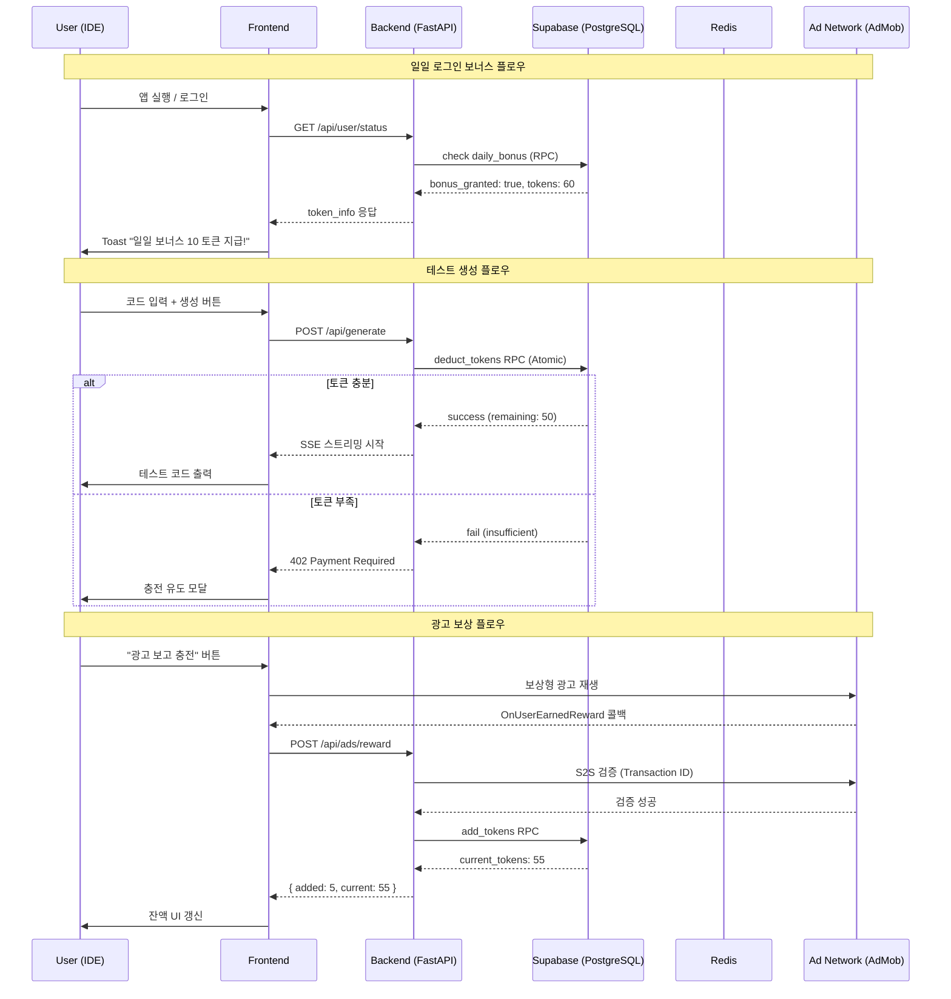
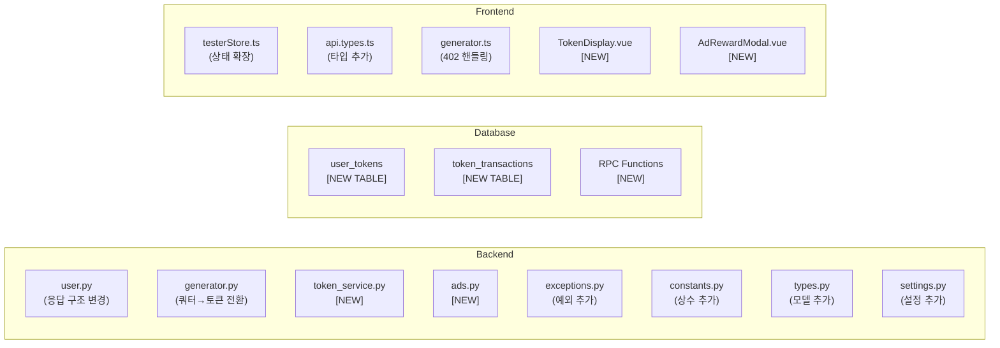
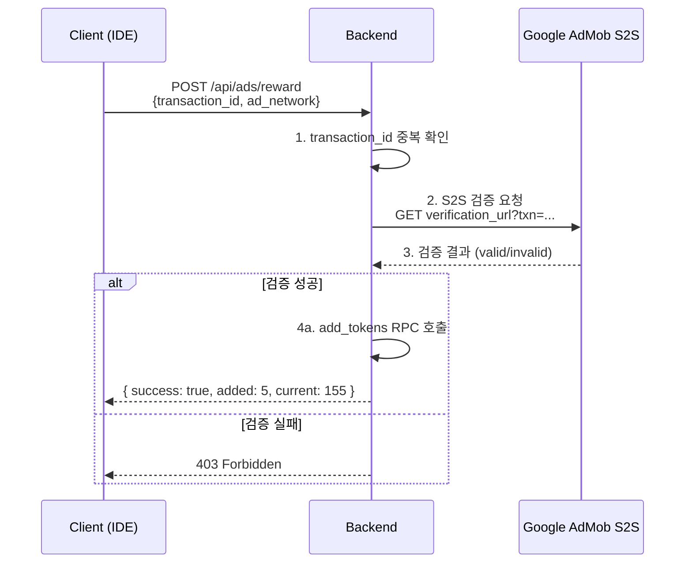

# 토큰 기반 쿼터 시스템 전환 - 상세 개발 계획서

| 문서 번호 | DEV-PLAN-001 |
| :--- | :--- |
| **작성일** | 2026-02-18 |
| **작성자** | Server Team (SJ-Son) |
| **기반 문서** | RFC-001 (Token System Transition) |
| **상태** | Draft |

---

## 1. RFC 검토 결과 및 개선 사항

기존 RFC-001을 현행 코드베이스와 대조하여 검토한 결과, 다음과 같은 보완이 필요합니다.

### 1.1 발견된 이슈

| # | 항목 | 현행 상태 | RFC 내용 | 개선 방향 |
| :-- | :--- | :--- | :--- | :--- |
| 1 | **API 경로** | `GET /api/user/status` | `GET /api/v1/users/me` | 기존 경로를 유지하되, 응답 구조만 확장 |
| 2 | **쿼터 상수** | `WEEKLY_LIMIT = 30` `generator.py` 내 하드코딩 | 미언급 | `constants.py`의 `TokenConstants` 클래스로 이관 |
| 3 | **DB 스키마** | `auth.users` (Supabase Auth 관리) | `users` 테이블에 `tokens` 컬럼 추가 | Supabase Auth 테이블은 직접 수정 불가. **별도 `user_tokens` 테이블 신설** |
| 4 | **예외 클래스** | `exceptions.py`에 Quota 관련 예외 없음 | 402 반환만 언급 | `InsufficientTokensError` 예외 클래스 신설 |
| 5 | **Atomic 연산** | 미구현 | "Atomic Operation 필수" 언급만 | **Supabase RPC (PostgreSQL Function)** 으로 구현 |
| 6 | **프론트엔드 402** | `generator.ts`에서 모든 에러를 일괄 처리 | 402 감지 후 모달 노출 | `generateTestCode`에 402 전용 분기 추가 |
| 7 | **토큰 수치** | 미정 | 미정 | 기본값 명시 필요 (아래 정책 섹션 참조) |
| 8 | **마이그레이션** | 미언급 | 미언급 | 기존 사용자에게 초기 토큰 지급 정책 수립 필요 |
| 9 | **광고 검증** | 미구현 | "Optional S2S 검증" | **S2S(Server-to-Server) 검증 필수** 경로로 설계 |

### 1.2 확정 필요 정책 (기획 협의 사항)

> [!IMPORTANT]
> 아래 수치는 초안이며, 기획팀 또는 PM과의 협의 후 `constants.py`에서 일괄 변경 가능합니다.

| 정책 | 초안 값 | 비고 |
| :--- | :--- | :--- |
| 신규 가입 시 초기 토큰 | **50** | 웰컴 보너스 |
| 일일 로그인 보너스 | **10** | 1일 1회, UTC 기준 |
| 광고 1회 시청 보상 | **5** | 보상형 영상 광고 |
| 1일 최대 광고 시청 횟수 | **10** | 일 50토큰 상한 |
| 테스트 생성 1회 비용 | **10** | 향후 모델별 차등 가능 |
| 기존 사용자 마이그레이션 | **30** | 기존 주간 한도 1주차분 |

---

## 2. 시스템 아키텍처

### 2.1 전체 플로우



### 2.2 변경 범위 요약



---

## 3. Phase 1: 서버 기초 공사 및 DB 마이그레이션

### 3.1 DB 스키마 변경

#### 3.1.1 `user_tokens` 테이블 신설

```sql
-- 사용자 토큰 잔액 관리 테이블
-- auth.users를 직접 수정하지 않고 별도 테이블로 관리
CREATE TABLE public.user_tokens (
    user_id UUID PRIMARY KEY REFERENCES auth.users(id) ON DELETE CASCADE,
    balance INTEGER NOT NULL DEFAULT 0 CHECK (balance >= 0),
    last_daily_bonus_at DATE,  -- 마지막 일일 보너스 수령일 (UTC)
    daily_ad_count INTEGER NOT NULL DEFAULT 0,  -- 금일 광고 시청 횟수
    daily_ad_reset_at DATE NOT NULL DEFAULT CURRENT_DATE,  -- 광고 횟수 리셋 기준일
    created_at TIMESTAMPTZ NOT NULL DEFAULT NOW(),
    updated_at TIMESTAMPTZ NOT NULL DEFAULT NOW()
);

-- RLS 정책
ALTER TABLE public.user_tokens ENABLE ROW LEVEL SECURITY;

CREATE POLICY "Users can view own tokens"
ON public.user_tokens FOR SELECT TO authenticated
USING (auth.uid() = user_id);

-- 인덱스 (user_id는 PK이므로 별도 불필요)
```

#### 3.1.2 `token_transactions` 테이블 신설

```sql
-- 토큰 거래 내역 (감사 로그)
CREATE TABLE public.token_transactions (
    id UUID DEFAULT uuid_generate_v4() PRIMARY KEY,
    user_id UUID NOT NULL REFERENCES auth.users(id) ON DELETE CASCADE,
    amount INTEGER NOT NULL,  -- 양수: 적립, 음수: 차감
    type VARCHAR(30) NOT NULL,  -- 'daily_bonus' | 'ad_reward' | 'generation' | 'welcome' | 'admin'
    description TEXT,
    balance_after INTEGER NOT NULL,  -- 거래 후 잔액 (스냅샷)
    reference_id VARCHAR(100),  -- 광고 Transaction ID 등 외부 참조
    created_at TIMESTAMPTZ NOT NULL DEFAULT NOW()
);

-- RLS 정책
ALTER TABLE public.token_transactions ENABLE ROW LEVEL SECURITY;

CREATE POLICY "Users can view own transactions"
ON public.token_transactions FOR SELECT TO authenticated
USING (auth.uid() = user_id);

-- 인덱스
CREATE INDEX idx_token_tx_user_id ON public.token_transactions (user_id);
CREATE INDEX idx_token_tx_created_at ON public.token_transactions (created_at DESC);
CREATE INDEX idx_token_tx_reference ON public.token_transactions (reference_id)
    WHERE reference_id IS NOT NULL;  -- 중복 검증용 부분 인덱스
```

#### 3.1.3 PostgreSQL RPC Functions (Atomic Operations)

```sql
-- 토큰 차감 (Atomic: 잔액 확인 + 차감을 단일 트랜잭션으로 처리)
CREATE OR REPLACE FUNCTION public.deduct_tokens(
    p_user_id UUID,
    p_amount INTEGER,
    p_description TEXT DEFAULT NULL
)
RETURNS JSON
LANGUAGE plpgsql
SECURITY DEFINER
AS $$
DECLARE
    v_current_balance INTEGER;
    v_new_balance INTEGER;
BEGIN
    -- FOR UPDATE로 행 잠금 (동시성 제어)
    SELECT balance INTO v_current_balance
    FROM public.user_tokens
    WHERE user_id = p_user_id
    FOR UPDATE;

    -- 사용자 토큰 레코드가 없는 경우
    IF NOT FOUND THEN
        RETURN json_build_object(
            'success', false,
            'error', 'USER_NOT_FOUND',
            'current_balance', 0
        );
    END IF;

    -- 잔액 부족
    IF v_current_balance < p_amount THEN
        RETURN json_build_object(
            'success', false,
            'error', 'INSUFFICIENT_TOKENS',
            'current_balance', v_current_balance,
            'required', p_amount
        );
    END IF;

    -- 차감 실행
    v_new_balance := v_current_balance - p_amount;
    UPDATE public.user_tokens
    SET balance = v_new_balance, updated_at = NOW()
    WHERE user_id = p_user_id;

    -- 거래 내역 기록
    INSERT INTO public.token_transactions
        (user_id, amount, type, description, balance_after)
    VALUES
        (p_user_id, -p_amount, 'generation', p_description, v_new_balance);

    RETURN json_build_object(
        'success', true,
        'deducted', p_amount,
        'current_balance', v_new_balance
    );
END;
$$;

-- 토큰 적립 (광고 보상, 일일 보너스 등)
CREATE OR REPLACE FUNCTION public.add_tokens(
    p_user_id UUID,
    p_amount INTEGER,
    p_type VARCHAR(30),
    p_description TEXT DEFAULT NULL,
    p_reference_id VARCHAR(100) DEFAULT NULL
)
RETURNS JSON
LANGUAGE plpgsql
SECURITY DEFINER
AS $$
DECLARE
    v_new_balance INTEGER;
BEGIN
    -- 중복 지급 방지 (reference_id가 있는 경우)
    IF p_reference_id IS NOT NULL THEN
        IF EXISTS (
            SELECT 1 FROM public.token_transactions
            WHERE reference_id = p_reference_id
        ) THEN
            RETURN json_build_object(
                'success', false,
                'error', 'DUPLICATE_TRANSACTION'
            );
        END IF;
    END IF;

    -- UPSERT: 레코드가 없으면 생성, 있으면 업데이트
    INSERT INTO public.user_tokens (user_id, balance, updated_at)
    VALUES (p_user_id, p_amount, NOW())
    ON CONFLICT (user_id) DO UPDATE
    SET balance = user_tokens.balance + p_amount,
        updated_at = NOW()
    RETURNING balance INTO v_new_balance;

    -- 거래 내역 기록
    INSERT INTO public.token_transactions
        (user_id, amount, type, description, balance_after, reference_id)
    VALUES
        (p_user_id, p_amount, p_type, p_description, v_new_balance, p_reference_id);

    RETURN json_build_object(
        'success', true,
        'added', p_amount,
        'current_balance', v_new_balance
    );
END;
$$;

-- 일일 보너스 처리 (조건부 지급)
CREATE OR REPLACE FUNCTION public.claim_daily_bonus(
    p_user_id UUID,
    p_bonus_amount INTEGER DEFAULT 10
)
RETURNS JSON
LANGUAGE plpgsql
SECURITY DEFINER
AS $$
DECLARE
    v_last_bonus DATE;
    v_today DATE := CURRENT_DATE;
    v_new_balance INTEGER;
BEGIN
    -- UPSERT로 레코드 보장
    INSERT INTO public.user_tokens (user_id, balance)
    VALUES (p_user_id, 0)
    ON CONFLICT (user_id) DO NOTHING;

    SELECT last_daily_bonus_at INTO v_last_bonus
    FROM public.user_tokens
    WHERE user_id = p_user_id
    FOR UPDATE;

    -- 이미 오늘 수령한 경우
    IF v_last_bonus = v_today THEN
        SELECT balance INTO v_new_balance
        FROM public.user_tokens
        WHERE user_id = p_user_id;

        RETURN json_build_object(
            'success', false,
            'already_claimed', true,
            'current_balance', v_new_balance
        );
    END IF;

    -- 보너스 지급
    UPDATE public.user_tokens
    SET balance = balance + p_bonus_amount,
        last_daily_bonus_at = v_today,
        daily_ad_count = 0,          -- 광고 횟수도 리셋
        daily_ad_reset_at = v_today,
        updated_at = NOW()
    WHERE user_id = p_user_id
    RETURNING balance INTO v_new_balance;

    -- 거래 내역
    INSERT INTO public.token_transactions
        (user_id, amount, type, description, balance_after)
    VALUES
        (p_user_id, p_bonus_amount, 'daily_bonus', '일일 로그인 보너스', v_new_balance);

    RETURN json_build_object(
        'success', true,
        'added', p_bonus_amount,
        'current_balance', v_new_balance
    );
END;
$$;
```

### 3.2 Backend 변경 사항

#### 3.2.1 `[NEW] backend/src/services/token_service.py`

```python
"""토큰 관리 서비스.

사용자 토큰의 조회, 적립, 차감을 담당합니다.
모든 토큰 변동은 Supabase RPC를 통해 Atomic하게 처리됩니다.
"""

class TokenService:
    """토큰 관련 비즈니스 로직을 처리하는 서비스.

    주요 역할:
    - 토큰 잔액 조회 (Redis 캐싱 적용)
    - 토큰 차감 (테스트 생성 시)
    - 토큰 적립 (광고 보상, 일일 보너스)
    - 일일 보너스 자동 처리
    """

    async def get_token_info(self, user_id: str) -> TokenInfo: ...
    async def deduct_tokens(self, user_id: str, amount: int) -> DeductResult: ...
    async def add_tokens(self, user_id: str, amount: int, 
                         token_type: str, reference_id: str | None) -> AddResult: ...
    async def claim_daily_bonus(self, user_id: str) -> DailyBonusResult: ...
    async def validate_ad_reward(self, user_id: str, 
                                  transaction_id: str) -> bool: ...
```

#### 3.2.2 `[MODIFY] backend/src/config/constants.py` — `TokenConstants` 추가

```python
class TokenConstants:
    """토큰 시스템 관련 상수."""

    WELCOME_BONUS: Final[int] = 50
    """신규 가입 시 초기 지급 토큰"""

    DAILY_BONUS: Final[int] = 10
    """일일 로그인 보너스"""

    AD_REWARD: Final[int] = 5
    """광고 1회 시청 보상"""

    MAX_DAILY_ADS: Final[int] = 10
    """1일 최대 광고 시청 횟수"""

    COST_PER_GENERATION: Final[int] = 10
    """테스트 생성 1회 비용"""

    MIGRATION_BONUS: Final[int] = 30
    """기존 사용자 마이그레이션 보너스"""

    CACHE_TTL: Final[int] = 300
    """토큰 잔액 캐시 TTL (5분)"""
```

#### 3.2.3 `[MODIFY] backend/src/exceptions.py` — 토큰 예외 추가

```python
# === 토큰/결제 레이어 예외 ===

class InsufficientTokensError(TesterException):
    """토큰 부족 시 발생하는 예외 (HTTP 402)."""

    def __init__(
        self,
        current: int,
        required: int,
    ) -> None:
        context = {"current": current, "required": required}
        super().__init__(
            message="토큰이 부족합니다",
            code="INSUFFICIENT_TOKENS",
            context=context,
        )
        self.current = current
        self.required = required

class DuplicateTransactionError(TesterException):
    """중복 보상 요청 시 발생하는 예외."""

    def __init__(self, transaction_id: str) -> None:
        super().__init__(
            message="이미 처리된 보상 요청입니다",
            code="DUPLICATE_TRANSACTION",
            context={"transaction_id": transaction_id[:16]},
        )

class AdRewardLimitError(TesterException):
    """일일 광고 시청 한도 초과 시 발생하는 예외."""

    def __init__(self, daily_limit: int) -> None:
        super().__init__(
            message=f"일일 광고 시청 한도({daily_limit}회)를 초과했습니다",
            code="AD_REWARD_LIMIT_EXCEEDED",
            context={"daily_limit": daily_limit},
        )
```

#### 3.2.4 `[MODIFY] backend/src/types.py` — 토큰 관련 모델 추가

```python
# === 토큰 시스템 모델 ===

class TokenInfo(BaseModel):
    """사용자 토큰 상태 응답 모델."""
    current_tokens: int
    daily_bonus_claimed: bool
    cost_per_generation: int
    daily_ad_remaining: int

class AdRewardRequest(BaseModel):
    """광고 보상 요청 모델."""
    ad_network: str = Field(..., description="광고 네트워크 식별자")
    transaction_id: str = Field(..., description="중복 방지용 트랜잭션 ID")
    timestamp: int = Field(..., description="광고 시청 완료 시각 (Unix)")

class AdRewardResponse(BaseModel):
    """광고 보상 응답 모델."""
    success: bool
    added_tokens: int = 0
    current_tokens: int

class TokenDeductResult(BaseModel):
    """토큰 차감 결과 모델."""
    success: bool
    deducted: int = 0
    current_balance: int
    error: str | None = None
```

#### 3.2.5 `[MODIFY] backend/src/api/v1/user.py` — 응답 구조 변경

```python
# 변경 전:
return {
    "user": current_user,
    "quota": {
        "limit": 30,
        "used": current_usage,
        "remaining": max(0, 30 - current_usage),
    },
}

# 변경 후:
token_info = await token_service.get_token_info(current_user["id"])
return {
    "user": current_user,
    "token_info": {
        "current_tokens": token_info.current_tokens,
        "daily_bonus_claimed": token_info.daily_bonus_claimed,
        "cost_per_generation": token_info.cost_per_generation,
        "daily_ad_remaining": token_info.daily_ad_remaining,
    },
    # 하위 호환성 유지 (Deprecated, 2~4주 후 제거)
    "quota": {
        "limit": 30,
        "used": 0,
        "remaining": token_info.current_tokens // token_info.cost_per_generation,
    },
}
```

#### 3.2.6 `[MODIFY] backend/src/api/v1/generator.py` — 쿼터 → 토큰 전환

```diff
- # 2. 주간 쿼터 확인 (30회/주)
- current_usage = await supabase_service.get_weekly_quota(current_user["id"])
- WEEKLY_LIMIT = 30
- if current_usage >= WEEKLY_LIMIT:
-     yield f"data: ..."
-     return

+ # 2. 토큰 차감 (Atomic)
+ deduct_result = await token_service.deduct_tokens(
+     user_id=current_user["id"],
+     amount=TokenConstants.COST_PER_GENERATION,
+ )
+ if not deduct_result.success:
+     if deduct_result.error == "INSUFFICIENT_TOKENS":
+         yield format_sse_event("error", {
+             "code": "INSUFFICIENT_TOKENS",
+             "message": "토큰이 부족합니다.",
+             "required": TokenConstants.COST_PER_GENERATION,
+             "current": deduct_result.current_balance,
+         })
+         return
```

> [!WARNING]
> 토큰 차감은 **스트리밍 시작 전**에 수행해야 합니다. 스트리밍 중간에 실패하면 토큰만 소모되고 결과를 못 받는 상황이 발생합니다. 차감 후 생성 실패 시 **토큰 환불(Refund)** 로직도 함께 구현해야 합니다.

#### 3.2.7 `[NEW] backend/src/api/v1/ads.py` — 광고 보상 API

```python
@router.post("/reward")
@limiter.limit("15/minute")
async def claim_ad_reward(
    request: Request,
    data: AdRewardRequest,
    current_user: AuthenticatedUser = Depends(get_current_user),
    token_service: TokenService = Depends(get_token_service),
):
    """광고 시청 완료 후 토큰 보상을 처리합니다."""
    ...
```

#### 3.2.8 `[MODIFY] backend/src/api/routers.py` — 라우터 등록

```diff
+ from src.api.v1 import ads

+ api_router.include_router(ads.router, prefix="/ads", tags=["ads"])
```

#### 3.2.9 `[MODIFY] backend/src/main.py` — 402 예외 핸들러 등록

```python
@app.exception_handler(InsufficientTokensError)
async def insufficient_tokens_handler(request: Request, exc: InsufficientTokensError):
    return JSONResponse(
        status_code=402,
        content={
            "detail": {
                "code": exc.code,
                "message": exc.message,
                "required": exc.required,
                "current": exc.current,
            }
        },
    )
```

---

## 4. Phase 2: 광고 시스템 및 보상 API 구현

### 4.1 S2S 광고 검증 플로우



### 4.2 일일 보너스 처리 로직

```
GET /api/user/status 호출 시:
  1. user_tokens 레코드 확인 (없으면 UPSERT로 생성 + 웰컴 보너스)
  2. last_daily_bonus_at ≠ 오늘(UTC) 이면:
     - claim_daily_bonus RPC 호출
     - 응답에 daily_bonus_claimed: true 포함
  3. daily_ad_reset_at ≠ 오늘이면:
     - daily_ad_count 리셋
  4. token_info 구성 후 반환
```

### 4.3 `[MODIFY] backend/src/config/settings.py` — 광고 관련 설정 추가

```python
# 광고 검증 설정
ADMOB_S2S_VERIFICATION_URL: str = Field(
    default="",
    description="AdMob S2S 검증 URL",
)
ADMOB_REWARD_AMOUNT: int = Field(
    default=5,
    description="광고 1회 시청 보상 토큰",
)
```

---

## 5. Phase 3: 클라이언트 (IDE) 구현

### 5.1 타입 정의 변경

#### `[MODIFY] frontend/src/types/api.types.ts`

```typescript
/** 토큰 정보 인터페이스 */
export interface TokenInfo {
    /** 현재 보유 토큰 */
    current_tokens: number
    /** 금일 로그인 보너스 수령 여부 */
    daily_bonus_claimed: boolean
    /** 테스트 1회 생성 비용 */
    cost_per_generation: number
    /** 금일 남은 광고 시청 횟수 */
    daily_ad_remaining: number
}

/** 사용자 상태 API 응답 */
export interface UserStatusResponse {
    user: {
        id: string
        email: string | null
    }
    token_info: TokenInfo
    /** @deprecated quota 필드는 하위 호환성을 위해 유지, token_info 사용 권장 */
    quota?: {
        limit: number
        used: number
        remaining: number
    }
}

/** 광고 보상 요청 */
export interface AdRewardRequest {
    ad_network: string
    transaction_id: string
    timestamp: number
}

/** 광고 보상 응답 */
export interface AdRewardResponse {
    success: boolean
    added_tokens: number
    current_tokens: number
}

/** 토큰 부족 에러 (402) */
export interface InsufficientTokensError {
    detail: {
        code: 'INSUFFICIENT_TOKENS'
        message: string
        required: number
        current: number
    }
}
```

### 5.2 Store 변경

#### `[MODIFY] frontend/src/stores/testerStore.ts`

```typescript
// 기존 usageStats를 tokenInfo로 교체
const tokenInfo = ref<TokenInfo>({
    current_tokens: 0,
    daily_bonus_claimed: false,
    cost_per_generation: 10,
    daily_ad_remaining: 10,
})

// 보너스 알림 표시 여부
const showBonusToast = ref(false)
// 토큰 부족 모달 표시 여부
const showInsufficientModal = ref(false)

const fetchUserStatus = async () => {
    if (!isLoggedIn.value) return
    try {
        const res = await fetch('/api/user/status', {
            headers: { 'Authorization': `Bearer ${userToken.value}` }
        })
        if (res.ok) {
            const data: UserStatusResponse = await res.json()
            tokenInfo.value = data.token_info

            // 일일 보너스 알림 (세션당 1회)
            if (data.token_info.daily_bonus_claimed && 
                !sessionStorage.getItem('bonus_notified')) {
                showBonusToast.value = true
                sessionStorage.setItem('bonus_notified', 'true')
            }
        }
    } catch (e) {
        console.error('사용자 상태 조회 실패', e)
    }
}
```

### 5.3 402 에러 핸들링

#### `[MODIFY] frontend/src/api/generator.ts`

```typescript
// generateTestCode 함수 내 response.ok 체크 부분 변경
if (!response.ok) {
    if (response.status === 402) {
        const errorData: InsufficientTokensError = await response.json()
        // 커스텀 에러 타입으로 throw하여 Store에서 분기 처리
        const err = new Error(errorData.detail.message)
        ;(err as any).code = 'INSUFFICIENT_TOKENS'
        ;(err as any).required = errorData.detail.required
        ;(err as any).current = errorData.detail.current
        throw err
    }
    // ... 기존 에러 처리
}
```

#### `[MODIFY] frontend/src/stores/testerStore.ts` — generateTestCode 함수

```typescript
} catch (err: any) {
    if (err.code === 'INSUFFICIENT_TOKENS') {
        // 토큰 부족 모달 표시
        showInsufficientModal.value = true
        error.value = '' // 에러 메시지는 모달로 대체
    } else {
        error.value = err.message
    }
}
```

### 5.4 신규 컴포넌트

| 컴포넌트 | 역할 | 위치 |
| :--- | :--- | :--- |
| `TokenDisplay.vue` | 상단 바에 토큰 잔액 표시, 클릭 시 충전 모달 오픈 | Header 영역 |
| `AdRewardModal.vue` | 광고 시청 버튼, 잔여 횟수 표시, 시청 중/완료 상태 관리 | 모달 |
| `InsufficientTokensModal.vue` | 토큰 부족 시 안내 문구 + 광고 충전 버튼 | 모달 |
| `DailyBonusToast.vue` | 일일 보너스 수령 알림 토스트 | Toast 레이어 |

---

## 6. Phase 4: 테스트 및 배포

### 6.1 테스트 계획

#### 6.1.1 Backend 단위 테스트

| 테스트 파일 (신설) | 테스트 항목 |
| :--- | :--- |
| `tests/unit/test_token_service.py` | 잔액 조회, 토큰 차감, 토큰 적립, 일일 보너스 처리 |
| `tests/unit/test_ads_router.py` | 광고 보상 API 정상/실패/중복/한도초과 케이스 |
| `tests/integration/test_token_flow.py` | 전체 플로우 (생성 → 토큰 차감 → 잔액 확인) |

```bash
# 실행 방법
cd backend && python -m pytest tests/unit/test_token_service.py -v
cd backend && python -m pytest tests/unit/test_ads_router.py -v
cd backend && python -m pytest tests/integration/test_token_flow.py -v
```

#### 6.1.2 핵심 테스트 시나리오

| # | 시나리오 | 기대 결과 |
| :--- | :--- | :--- |
| 1 | 신규 유저 첫 로그인 | 웰컴 50 + 일일 보너스 10 = 60 토큰 |
| 2 | 토큰 10 보유 시 생성 요청 | 생성 성공, 잔액 0 |
| 3 | 토큰 5 보유 시 생성 요청 (비용 10) | 402 반환, 잔액 변동 없음 |
| 4 | 광고 시청 후 보상 요청 | +5 토큰, 잔액 정상 증가 |
| 5 | 같은 `transaction_id`로 2회 요청 | 1회만 지급, 2회차 `DUPLICATE` 에러 |
| 6 | 일일 광고 상한 도달 후 추가 요청 | `AD_REWARD_LIMIT_EXCEEDED` 에러 |
| 7 | 동시 생성 요청 2건 (토큰 10) | 1건만 성공, 1건 402 |
| 8 | 생성 중 AI 서비스 장애 | 토큰 환불, 잔액 복원 |
| 9 | 일일 보너스 2회 수령 시도 | 1회만 지급, 2회차 `already_claimed` |
| 10 | 자정(UTC) 넘긴 후 상태 조회 | 일일 보너스 재수령 가능, 광고 횟수 리셋 |

### 6.2 배포 전략

```
1단계: Staging 배포 + DB 마이그레이션
  - Supabase SQL Editor에서 테이블 및 RPC 생성
  - Staging 환경에 백엔드 배포
  - 기존 유저 마이그레이션 스크립트 실행 (30 토큰 지급)

2단계: 프론트엔드 Staging 배포
  - IDE 클라이언트에 토큰 UI 반영
  - 테스트 광고(Test Ad)로 연동 확인

3단계: Production 배포
  - 백엔드 먼저 배포 (하위 호환성 유지)
  - 프론트엔드 이후 배포
  - Test Ad → Production Ad 전환

4단계: 모니터링 (1주)
  - 토큰 관련 에러 로그 감시
  - 비정상 토큰 적립 패턴 감지 (Abuse)
  - 사용자 피드백 수집
```

---

## 7. 파일 변경 목록 요약

### Backend (서버)

| 구분 | 파일 경로 | 설명 |
| :--- | :--- | :--- |
| **NEW** | `backend/src/services/token_service.py` | 토큰 관리 서비스 |
| **NEW** | `backend/src/api/v1/ads.py` | 광고 보상 API 라우터 |
| **NEW** | `backend/src/db/token_schema.sql` | 토큰 DB 스키마 및 RPC |
| **NEW** | `backend/tests/unit/test_token_service.py` | TokenService 단위 테스트 |
| **NEW** | `backend/tests/unit/test_ads_router.py` | Ads API 단위 테스트 |
| **MODIFY** | `backend/src/config/constants.py` | `TokenConstants` 클래스 추가 |
| **MODIFY** | `backend/src/config/settings.py` | 광고 검증 관련 환경 변수 추가 |
| **MODIFY** | `backend/src/exceptions.py` | 토큰/광고 예외 클래스 추가 |
| **MODIFY** | `backend/src/types.py` | 토큰 관련 Pydantic 모델 추가 |
| **MODIFY** | `backend/src/api/v1/user.py` | 응답 구조 변경 (`token_info`) |
| **MODIFY** | `backend/src/api/v1/generator.py` | 쿼터 → 토큰 차감 전환 |
| **MODIFY** | `backend/src/api/routers.py` | `ads` 라우터 등록 |
| **MODIFY** | `backend/src/main.py` | 402 예외 핸들러 등록 |

### Frontend (클라이언트)

| 구분 | 파일 경로 | 설명 |
| :--- | :--- | :--- |
| **NEW** | `frontend/src/components/TokenDisplay.vue` | 토큰 잔액 표시 컴포넌트 |
| **NEW** | `frontend/src/components/AdRewardModal.vue` | 광고 시청 모달 |
| **NEW** | `frontend/src/components/InsufficientTokensModal.vue` | 토큰 부족 안내 모달 |
| **NEW** | `frontend/src/components/DailyBonusToast.vue` | 일일 보너스 알림 |
| **MODIFY** | `frontend/src/types/api.types.ts` | 토큰 관련 타입 추가 |
| **MODIFY** | `frontend/src/stores/testerStore.ts` | `usageStats` → `tokenInfo` 전환 |
| **MODIFY** | `frontend/src/api/generator.ts` | 402 에러 핸들링 |

### Database

| 구분 | 대상 | 설명 |
| :--- | :--- | :--- |
| **NEW** | `public.user_tokens` 테이블 | 사용자 토큰 잔액 |
| **NEW** | `public.token_transactions` 테이블 | 거래 내역 (감사 로그) |
| **NEW** | `deduct_tokens()` RPC | 토큰 차감 (Atomic) |
| **NEW** | `add_tokens()` RPC | 토큰 적립 (Idempotent) |
| **NEW** | `claim_daily_bonus()` RPC | 일일 보너스 처리 |

---

**비고**:
*   이 문서는 RFC-001을 기반으로 한 **상세 개발 계획서**입니다.
*   Phase 1~2 (서버)와 Phase 3 (클라이언트)는 API 명세 확정 후 **병렬 진행** 가능합니다.
*   모든 토큰 수치는 `constants.py` 한 곳에서 관리되므로, 기획 변경 시 단일 파일만 수정하면 됩니다.
